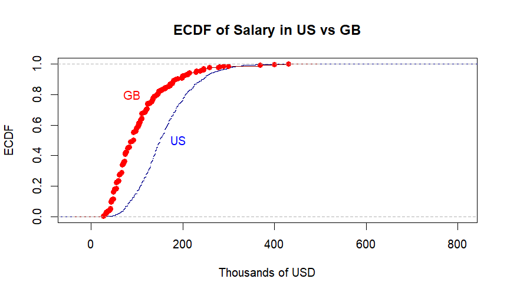
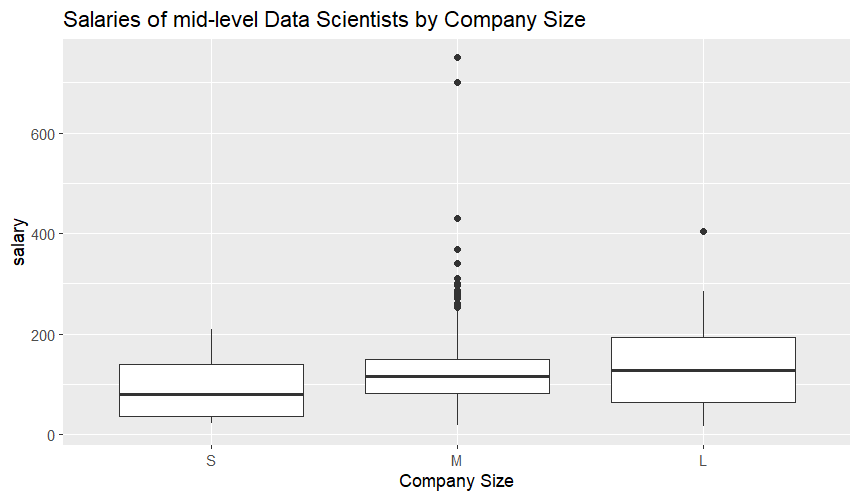
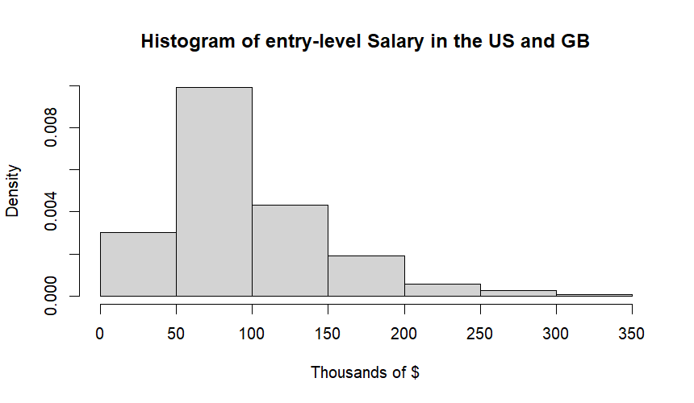
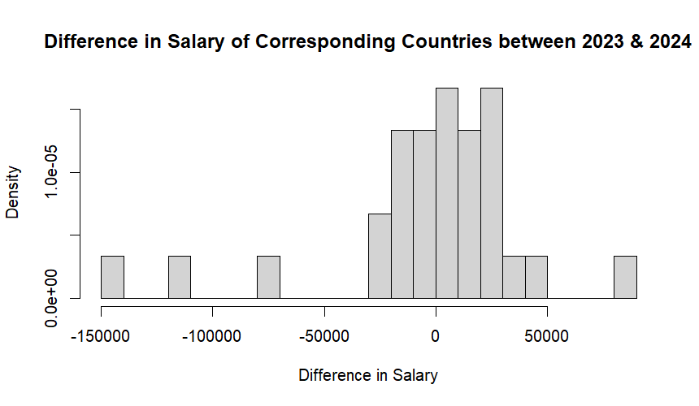

# Data Science Salaries - Non-Parametric Statistical Analysis (R)
## 📖 Overview
This repository contains an academic project completed as part of the course **Non-Parametric Statistics**.

It explores salary patterns in the data science job market using real-world data from 2020-2024. The analysis focuses on non-parametric statistical methods, empirical distribution functions and hypothesis testing, implemented in **R**.

The goal is to investigate how salaries vary across:

- countries (US vs Great Britain)
- experience level
- company size
- employment types
- years

## 🗂️ Dataset
The dataset is sourced from ai-jobs.net and can be downloaded from kaggle.com:
[Latest Data Science Job Salaries (2024) - Kaggle](https://www.kaggle.com/datasets/saurabhbadole/latest-data-science-job-salaries-2024)

It contains structured information on data science salaries including:

- experience level
- employment type
- company location
- company size
- annual salary (USD)
- time period (2020-2024)

Additionally, a secondary dataset is used for country-based average salaries (2023 vs 2024).

## 📋 Research Questions
This analysis addresses the following statistical questions:

- Do data science salaries differ significantly between the US and Great Britain?
- How do salaries vary accross experience levels and company sizes?
- Are salary distributions consistent with known parametric families (Gamma, Log-Normal)?
- Do mid-level salaries depend on company size?
- Have average salaries changed between 2023 and 2024?
- How strongly are salaries correlated across consecutive years?

## 📈 Statistical Methods Used
The project included applications of: 

- Empirical Cumulative Distribution Functions (ECDF)
- Kolmogorov-Smirnov Test
- Anderson-Darling k-sample Test
- Mann-Whitney Test
- Chi-Square Test of Homogeneity
- Sign Test
- Spearman Correlation
- Distribution fitting and goodness-of-fit tests
- Exploratory data visualization

## ⚙️ Tools and Technologies Used
- R
- RStudio
- ggplot2
- dplyr
- kSamples
- KScorrect
- coin
- moments

## 📊 Key Findings 
- Salaries in the US are stochastically greater than in Great Britain.

- Company size significantly affects salaries, especially for mid-level data scientists.

- Entry-level salaries in US/GB are better approximated by a Log-Normal distribution than a Gamma distribution

- No statistically significant change was detected in average salaries between 2023 and 2024.

- Salary distributions differ significantly across experience levels and company sizes.

## ▶️ How to Run

1. Clone or download this repository.

2. Open `DataSalaries.Rproj` in RStudio.

3. Install the required packages:

```r
install.packages(c("ggplot2", "dplyr", "KScorrect", "kSamples", "moments", "coin"))
```
4. Run the script:

```r
source("analysis.R") 
```

## ✍️ Notes 
- All analysis and interpretation are contained directly in the `analysis.R` script via detailed comments.
- No external report was produced. The script itself serves as a full analytical write-up.

## 👨‍💻 Author

Marios Giannakopoulos  
Department of Mathematics  
National and Kapodistrian University of Athens


